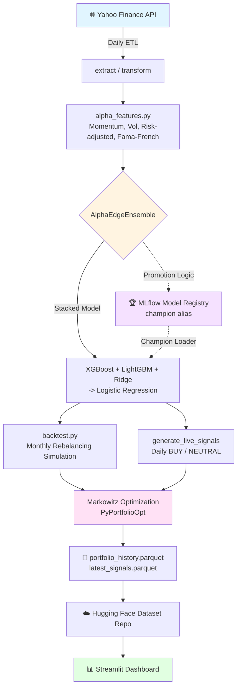

<div align="center">

# 📈 AlphaEdge: AI-Powered Multi-Market Portfolio Manager

**Production-Ready Quantitative Trading System with Daily MLOps Pipeline**

Combining Gradient Boosting Ensembles, Market Regime Detection & Modern Portfolio Theory for Automated Asset Allocation across CAC40, US Tech and BRVM

[](https://www.python.org/downloads/)
[](https://cac40-smart-portfolio-asset.streamlit.app/)
[](https://soradata-alphaedge-registry.hf.space)
[](https://github.com/SORADATA/CAC40-Quantitative-Analysis-Predictive-Asset-Allocation/releases)
[](https://opensource.org/licenses/MIT)
[](https://github.com/psf/black)


[🌐 **Live Dashboard**](https://cac40-smart-portfolio-asset.streamlit.app/) • [📊 **Performance**](#-performance-metrics) • [🏗️ **Architecture**](#️-system-architecture) • [🚀 **Quick Start**](#-quick-start) • [🐛 **Report Issue**](https://github.com/SORADATA/CAC40-Quantitative-Analysis-Predictive-Asset-Allocation/issues)

</div>

---

## 🎯 Why AlphaEdge?

Traditional portfolio management relies on static allocations and reactive rebalancing. **AlphaEdge** flips this paradigm by implementing a **fully automated, multi-market AI-driven investment strategy** that:

- 🌍 **Runs across multiple markets** (CAC40, US Tech, BRVM) from a single codebase, driven by JSON configs
- 🔄 **Rebalances monthly** based on model conviction, with daily live signal generation
- 🤖 **Requires zero manual intervention** through GitHub Actions automation
- 🏆 **Self-governs its own model deployment** via an MLflow champion/challenger promotion system
- 🎓 **Built on academic rigor** from quantitative finance research (Markowitz, Ledoit-Wolf, Fama-French)

> **Perfect for:** Quantitative researchers, algo traders, data scientists, and finance students looking to deploy production-grade ML strategies.

---

## 🌟 Key Features

### 🧠 Ensemble AI Architecture
- **Gradient Boosting Ensemble:** XGBoost + LightGBM + Ridge, stacked via Logistic Regression, predicts 1-month upside probability per stock
- **Market Regime Detection:** K-Means clustering on RSI-based features to characterize the current market state
- **Walk-Forward Validation:** stability of AUC/APR is checked across 4 rolling time windows before trusting a model

### ⚖️ Advanced Portfolio Optimization
- **Markowitz Mean-Variance Framework** with Ledoit-Wolf covariance shrinkage (`PyPortfolioOpt`)
- **Max Sharpe objective** with L2 regularization, falling back to equal-weight when too few assets qualify
- **Transaction cost & turnover modeling** applied at every monthly rebalance

### ☁️ Production-Grade MLOps
- **MLflow Model Registry** with a `champion` alias: every new training run is only promoted if it beats the current champion on Sortino ratio without degrading Max Drawdown by more than 2%
- **Hard safety thresholds** (`SHARPE_THRESHOLD`, `MAX_DD_THRESHOLD`) that block promotion of any model that is not financially sound, regardless of ML metrics
- **Local fallback** (`ensemble_model.pkl` + `model_card.json`) if MLflow / `HF_TOKEN` is unavailable, so the daily pipeline never fully breaks
- **Automated daily ETL + backtest + signal generation** via GitHub Actions, with results synced to a Hugging Face dataset repo

### 📊 Interactive Analytics (Streamlit)
- Real-time performance tracking vs each market's benchmark, with zoomable time ranges
- Daily BUY/NEUTRAL signal table with allocation weights and upside probability
- Drawdown chart, recovery time, and full period-return breakdown (1M/3M/6M/YTD/1Y)
- Live candlestick explorer per ticker (yfinance) and model performance / feature importance tab

---

## 📸 Dashboard Preview

<div align="center">

| **Portfolio Performance** | **AI Trading Signals** |
|:---:|:---:|
|  |  |

*Live tracking of cumulative returns, Sharpe ratio, and maximum drawdown (left). Daily probabilistic forecasts with market regime indicators (right).*

</div>

---

## 📊 Performance Metrics (Live & Backtest)

Data updated as of: **2026-02-05**

| Metric | AlphaEdge Strategy 🤖 | CAC40 Benchmark 🇫🇷 |
| :--- | :---: | :---: |
| **Total Return** | **+121.9%** 🚀 | +87.9% |
| **Alpha (vs Bench)** | **+34.0%** | N/A |
| **YTD Performance** | **+9.5%** | TBD |
| **Sharpe Ratio** | **0.63** | N/A |
| **Max Drawdown** | **-32.0%** | TBD |

> **Note:** Figures above cover the CAC40 market. Other configured markets (US Tech, BRVM) have independent metrics, viewable per-market on the [live dashboard](https://cac40-smart-portfolio-asset.streamlit.app/).

*Metrics updated daily. Benchmark curve now compounds correctly month-over-month (fixed in the latest backtest engine revision — see [Changelog](CHANGELOG.md)).*

---

## 🏗️ System Architecture

The entire pipeline runs autonomously with zero maintenance required, once configured.



### Pipeline Components

1. **ETL Layer** (`src/pipeline/etl.py`, `src/extract/`, `src/transform/`): fetches raw market data, handles ticker changes/delisting, and persists `daily_raw.parquet` / `monthly_features.parquet` per market
2. **Feature Store** (`src/features/alpha_features.py`): momentum, mean-reversion, volatility, risk-adjusted (Sharpe/Sortino/Calmar), tail-risk (VaR/CVaR), technical enrichment and Fama-French betas
3. **Math Utilities** (`src/utils/math_utils.py`): shared rolling-window statistics (`_safe_div`, `_rolling_sortino`, `_rolling_maxdrawdown`) used across features and metrics
4. **ML Model** (`src/models/ensemble.py`): `AlphaEdgeEnsemble`, trained and evaluated via `train.py`, with walk-forward validation
5. **Model Registry** (`src/models/model_loader.py`): resolves the active "champion" model, MLflow-first with local pickle fallback
6. **Backtest & Signal Engine** (`src/pipeline/backtest.py`): monthly rebalancing simulation + daily live signal scoring
7. **Orchestrator** (`daily_run.py`): runs the full ETL → backtest → signals → upload cycle per market, defined in `config/markets/*.json`
8. **Dashboard** (`app.py`): Streamlit app reading synced parquet files from Hugging Face, with per-market navigation

---

## 🚀 Quick Start

### Prerequisites

- Python 3.10 or higher
- Git installed
- (Optional) `HF_TOKEN` environment variable for MLflow tracking and Hugging Face dataset sync

### Installation

```bash
# Clone the repository
git clone https://github.com/SORADATA/CAC40-Quantitative-Analysis-Predictive-Asset-Allocation.git
cd CAC40-Quantitative-Analysis-Predictive-Asset-Allocation

# Create virtual environment (recommended)
python -m venv venv
source venv/bin/activate  # On Windows: venv\Scripts\activate

# Install dependencies
pip install -r requirements.txt

# (Optional) configure environment variables
cp .env.example .env
# then edit .env and set HF_TOKEN, HF_REPO_ID
```

### Running Locally

**Option 1 — Launch the dashboard**
```bash
streamlit run app.py
```
Opens the interactive multi-market dashboard at `http://localhost:8501`.

**Option 2 — Run the full daily pipeline**
```bash
python daily_run.py
```
Executes ETL → backtest → live signal generation → (optional) Hugging Face sync, for every market defined in `config/markets/`.

**Option 3 — Train / retrain a model**
```bash
python train.py
```
Trains `AlphaEdgeEnsemble` for every configured market, runs walk-forward validation, and (if `HF_TOKEN` is set) evaluates promotion to MLflow `champion`.

---

## 📂 Project Structure
CAC40-Quantitative-Analysis-Predictive-Asset-Allocation/
├── .github/
│ └── workflows/
│ └── daily_run.yml # Automated daily execution (ETL + backtest + signals)
├── config/
│ └── markets/ # One JSON per market (tickers, benchmark, name)
│ ├── cac40.json
│ ├── us_tech.json
│ └── brvm.json
├── data/
│ ├── raw/ # Historical price data
│ └── processed/
│ └── <MARKET>/
│ ├── daily_raw.parquet
│ ├── monthly_features.parquet
│ ├── portfolio_history.parquet
│ ├── rebalance_history.parquet
│ └── latest_signals.parquet
├── images/ # Screenshots & visualizations
├── models/
│ └── <MARKET>/
│ ├── ensemble_model.pkl # Local fallback model
│ └── model_card.json # Training metadata & metrics
├── notebooks/ # Research: EDA, model training, backtesting
├── src/
│ ├── extract/
│ │ └── extractor.py # Market data extraction (yfinance)
│ ├── transform/
│ │ ├── processor.py # Daily/monthly aggregation
│ │ └── ticker_manager.py # Ticker changes & delisting handling
│ ├── features/
│ │ └── alpha_features.py # Feature engineering (momentum, vol, risk, FF betas)
│ ├── models/
│ │ ├── ensemble.py # AlphaEdgeEnsemble (XGBoost+LightGBM+Ridge -> LogReg)
│ │ └── model_loader.py # MLflow champion loader with local fallback
│ ├── pipeline/
│ │ ├── etl.py # get_data_pipeline orchestration
│ │ └── backtest.py # Monthly rebalancing simulation + live signals
│ └── utils/
│ ├── math_utils.py # Shared rolling-window statistics
│ ├── metrics.py # Financial metrics (Sharpe, Sortino, Calmar, MDD)
│ ├── market_utils.py # Benchmark returns helper
│ ├── feature_utils.py # ATR / MACD computation
│ ├── config_loader.py
│ └── logger.py
├── tests/ # Unit tests
├── app.py # Streamlit dashboard (multi-market)
├── daily_run.py # Main daily pipeline orchestrator
├── train.py # Training + walk-forward + MLflow promotion
├── const.py # Centralized constants & thresholds
├── requirements.txt # Python dependencies
├── CHANGELOG.md # Notable fixes and changes per version
├── LICENSE # MIT License
└── README.md # You are here!


---

## 🔧 Customization Guide

### Adding a New Market

AlphaEdge is designed to scale to new markets without touching the core pipeline code.

1. **Fork this repository** (click the Fork button above)

2. **Add a new config file** in `config/markets/`, e.g. `config/markets/sp500.json`:
```json
{
    "market_name": "SP500",
    "tickers": ["AAPL", "MSFT", "GOOGL", "AMZN", "NVDA"],
    "benchmark_ticker": "^GSPC"
}
```

3. **Train the model** for the new market:
```bash
python train.py
```
This automatically discovers every config file in `config/markets/` and trains one `AlphaEdgeEnsemble` per market.

4. **Run the daily pipeline** — `daily_run.py` will iterate over all configured markets, backtest, generate signals, and sync results.

5. **Push changes** — the dashboard's market selector auto-discovers new markets from the Hugging Face dataset repo, no dashboard code change required.

### Tuning Key Parameters

Central configuration lives in `const.py`:

| Parameter | Description | Notes |
|-----------|-------------|-------|
| `SHARPE_THRESHOLD` | Minimum Sharpe ratio required for MLflow promotion | Hard safety gate |
| `MAX_DD_THRESHOLD` | Minimum (least negative) Max Drawdown required for promotion | Hard safety gate |
| `PROBA_MIN` | Minimum predicted upside probability to consider a stock | Filters the investable universe monthly |
| `MAX_STOCKS_SELECT` | Maximum number of stocks held per rebalance | Controls concentration |
| `MIN_STOCKS_OPTIM` | Minimum stocks required to run Markowitz (else equal-weight) | Stability fallback |
| `TRANSACTION_COST` | Cost applied to portfolio turnover at each rebalance | Realism of backtest |
| `BACKTEST_YEARS` | Lookback window for the daily backtest | Data volume vs relevance trade-off |

---

## 📚 Technical Deep Dive

### Feature Engineering (`src/features/alpha_features.py`)

The model uses features across several categories, computed per ticker via rolling windows:

- **Momentum:** multi-horizon returns (1/2/3/6/9/12 months), momentum spreads (`mom_12_1`, `mom_6_1`)
- **Mean-Reversion:** price z-score vs 12-month moving average, nearness to 52-week high
- **Volatility:** realized volatility (3m/12m), volatility ratio, idiosyncratic volatility vs market factor
- **Risk-Adjusted:** rolling Sharpe (3m/6m), rolling Sortino (6m), Calmar proxy
- **Tail Risk:** rolling skew/kurtosis, historical VaR (5%), CVaR (5%)
- **Technical Enrichment:** RSI divergence, Amihud illiquidity, volume trend & z-score
- **Fama-French:** rolling 5-factor betas (Europe factors) via `RollingOLS`
- **Seasonality:** cyclical month encoding, quarter-end and January flags
- **Cross-Sectional Ranks:** percentile rank of key factors within each month

> ⚠️ Rolling-window features require sufficient historical depth (up to 12 months) to be reliable. The backtest engine explicitly excludes months with insufficient per-ticker history rather than silently scoring on zero-filled features — see [Changelog](CHANGELOG.md).

### Model Training (`train.py`)

**AlphaEdgeEnsemble:**
- Binary classification target: next-month price direction (up/down)
- Stacked architecture: XGBoost + LightGBM + Ridge → Logistic Regression meta-learner
- Hyperparameter tuning via Optuna (50 trials for the final model, 20 for walk-forward windows)
- Evaluated via AUC / Average Precision on a held-out 6-month test window

**Walk-Forward Validation:**
- 4 rolling windows of 3 months each, re-trained independently, to check temporal stability of AUC before trusting the final model

**MLflow Champion/Challenger:**
- Every training run is logged to MLflow with ML metrics (AUC) and financial metrics (Sharpe, Sortino, Calmar, Max Drawdown)
- A challenger is promoted to `champion` only if it clears absolute safety thresholds **and** improves Sortino ratio without degrading Max Drawdown by more than 2% vs the current champion

### Portfolio Optimization (`src/pipeline/backtest.py`)

Implements **Markowitz Mean-Variance Optimization** via `PyPortfolioOpt`:
- Expected returns via **EMA historical return** (252-day span)
- Covariance matrix via **Ledoit-Wolf shrinkage** (addresses estimation error)
- Objective: **Maximize Sharpe ratio** with L2 regularization to avoid concentrated weights
- Fallback to **equal-weight** allocation when fewer than `MIN_STOCKS_OPTIM` assets qualify, or when the optimizer fails to converge
- Monthly rebalancing with **turnover-based transaction costs**, and a benchmark curve that compounds continuously across the full backtest window

---

## 🤝 Contributing

Contributions are welcome! Here's how you can help:

1. **Report bugs** via [GitHub Issues](https://github.com/SORADATA/CAC40-Quantitative-Analysis-Predictive-Asset-Allocation/issues)
2. **Suggest features** in the Discussions tab
3. **Submit pull requests** following the code style guidelines below

### Development Setup

```bash
# Install development dependencies
pip install -r requirements-dev.txt

# Run linting
black src/ --check
flake8 src/

# Run tests
pytest tests/
```

---

## 📖 Research & References

This project builds upon:

- Markowitz, H. (1952). "Portfolio Selection". *Journal of Finance*
- Friedman, J. et al. (2001). "Greedy Function Approximation: A Gradient Boosting Machine"
- Ledoit, O. & Wolf, M. (2004). "Honey, I Shrunk the Sample Covariance Matrix"
- Fama, E. & French, K. (2015). "A Five-Factor Asset Pricing Model". *Journal of Financial Economics*
- Bailey, D. et al. (2017). "Stock Portfolio Design and Backtest Overfitting". *Journal of Investment Management*

---

## ⚠️ Disclaimer

**This project is for educational and research purposes only.**

- ❌ Not financial advice or investment recommendations
- ❌ No guarantee of profitability or performance
- ❌ Past results do not predict future outcomes
- ⚠️ Algorithmic trading involves substantial risk of capital loss

Always consult with a licensed financial advisor before making investment decisions.

---

## 📜 License

This project is licensed under the **MIT License** - see the [LICENSE](LICENSE) file for details.

You are free to use, modify, and distribute this code with attribution.

---

## 🙏 Acknowledgments

Developed as part of the **Master 2 - Statistics Expertise for Finance & Economics** program at **Université de Lorraine**.

Special thanks to:
- The open-source community for libraries (Streamlit, scikit-learn, XGBoost, LightGBM, PyPortfolioOpt, MLflow)
- Publicly available market data providers powering this research

---

<div align="center">

### 💡 Found this useful?

⭐ **Star this repo** to show support!

🔀 **Fork it** to build your own strategy!

📢 **Share it** with fellow quants and developers!

---

**Developed by [SORADATA](https://github.com/SORADATA)**

[](https://github.com/SORADATA)
[](https://twitter.com/SORADATA)

</div>