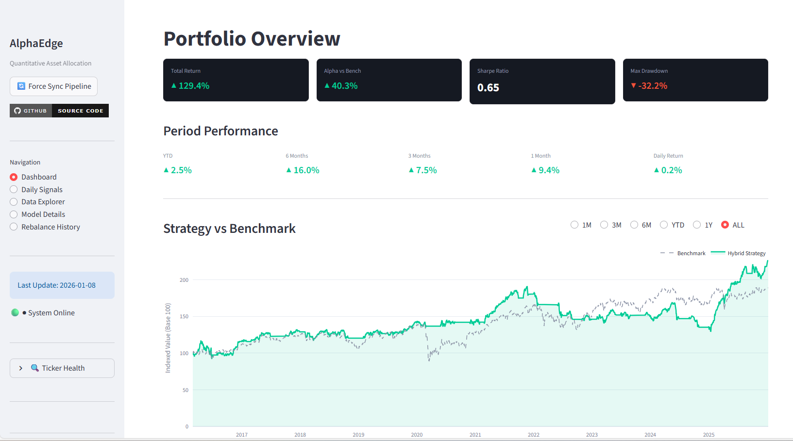
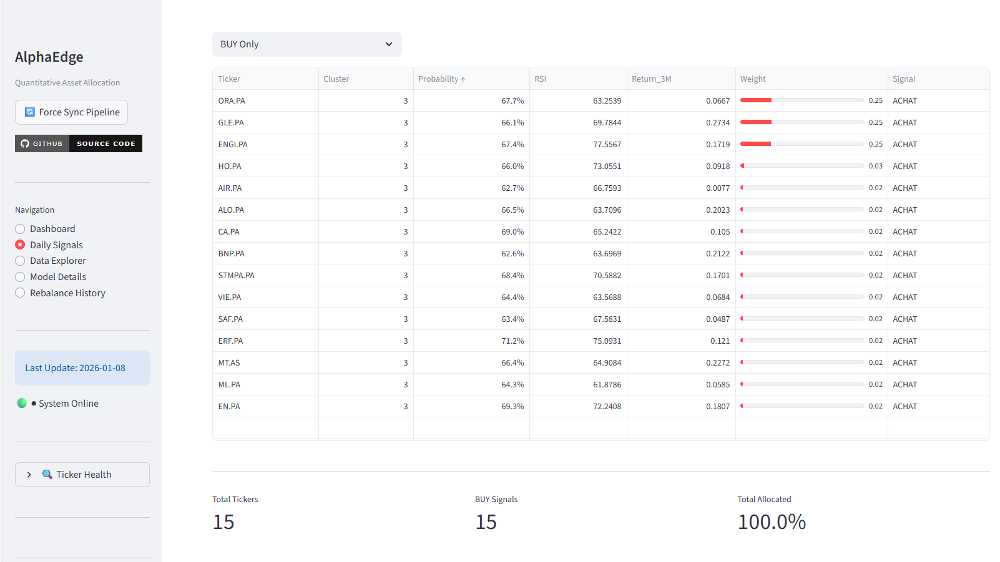
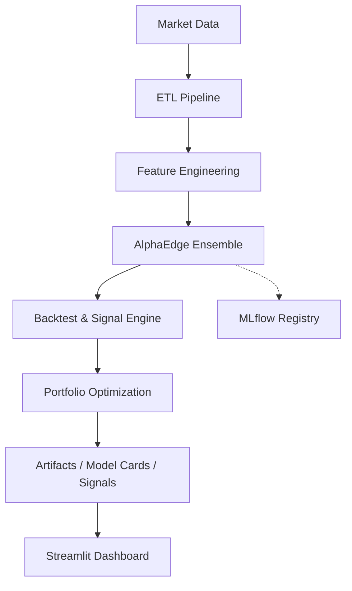

<div align="center">

# 📈 AlphaEdge: AI-Powered Multi-Market Portfolio Manager

**Production-Ready Quantitative Trading System with Daily MLOps Pipeline**

Machine-learning driven portfolio allocation for CAC40, with a reusable architecture that can be extended to additional markets.

[](https://www.python.org/downloads/)
[](https://cac40-smart-portfolio-asset.streamlit.app/)
[](https://soradata-alphaedge-registry.hf.space)
[](https://github.com/SORADATA/CAC40-Quantitative-Analysis-Predictive-Asset-Allocation/releases)
[](https://opensource.org/licenses/MIT)
[](https://github.com/psf/black)

[🌐 **Live Dashboard**](https://cac40-smart-portfolio-asset.streamlit.app/) • [📊 **Performance**](#-performance-metrics) • [🏗️ **Architecture**](#️-system-architecture) • [🚀 **Quick Start**](#-quick-start) • [🐛 **Issues**](https://github.com/SORADATA/CAC40-Quantitative-Analysis-Predictive-Asset-Allocation/issues)

</div>

---

## 🎯 Overview

AlphaEdge is a quantitative portfolio management project that combines feature engineering, ensemble machine learning, portfolio optimization, and a Streamlit dashboard in a single codebase.

The current repository is organized around a **CAC40 production setup**, while keeping reusable modules for extension to other universes and market configurations.

---

## 🌟 Core Features

### 🧠 Machine Learning Engine
- Ensemble modeling with **XGBoost, LightGBM, Ridge, and Logistic Regression stacking**
- Market regime detection using **K-Means** on technical features
- Walk-forward validation to evaluate temporal robustness before promotion

### ⚖️ Portfolio Construction
- Mean-variance optimization with **PyPortfolioOpt**
- Ledoit-Wolf covariance shrinkage for more stable risk estimates
- Monthly rebalancing with transaction cost handling and fallback allocation logic

### ☁️ MLOps Workflow
- MLflow-based registry / promotion workflow for model tracking
- Local model fallback with `ensemble_model.pkl` and `model_card.json`
- Automated workflows under `.github/workflows/` for training, releases, and updates

### 📊 Visualization
- Streamlit dashboard for performance monitoring and signal inspection
- Dashboard screenshots already included in `images/`
- Changelog and contribution files maintained at repository root

---

## 📸 Dashboard Preview

<div align="center">

| Portfolio Performance | AI Trading Signals |
|:---:|:---:|
|  |  |

</div>

---

## 📊 Performance Metrics

The dashboard section can display strategy return, benchmark comparison, drawdown, and signal information.

If you want this README to stay strictly accurate over time, update the numeric metrics directly from the latest dashboard or backtest output before each release.

---

## 🏗️ System Architecture



### Main Components

1. **Extraction layer**: market data loading and preprocessing
2. **Feature layer**: momentum, volatility, risk-adjusted, and technical features
3. **Model layer**: ensemble training, cross-validation, model loading, and promotion logic
4. **Pipeline layer**: ETL, backtest, and daily execution utilities
5. **Presentation layer**: Streamlit app for monitoring results

---

## 🚀 Quick Start

### Prerequisites

- Python 3.10+
- Git
- Recommended: virtual environment
- Optional: `HF_TOKEN` for remote sync / registry integration

### Installation

```bash
git clone https://github.com/SORADATA/CAC40-Quantitative-Analysis-Predictive-Asset-Allocation.git
cd CAC40-Quantitative-Analysis-Predictive-Asset-Allocation
python -m venv venv
source venv/bin/activate  # On Windows: venv\Scripts\activate
pip install -r requirements.txt
```

### Run the dashboard

```bash
streamlit run app.py
```

### Run the daily pipeline

```bash
python src/pipeline/daily_run.py
```

### Train the model

```bash
python src/models/train.py
```

---

## 📂 Project Structure

```text
.
├── .github
│   └── workflows
│       ├── daily_update.yml
│       ├── ml_pipeline.yml
│       ├── pre-release.yml
│       ├── python-app.yml
│       └── release.yml
├── CHANGELOG.md
├── CONTRIBUTING.md
├── README.md
├── app.py
├── config
│   └── markets
│       └── cac40.json
├── const.py
├── debug_run.txt
├── dev.sh
├── images
│   ├── Dashboard.png
│   └── Signal.png
├── notebooks
│   └── 01_EDA.ipynb
├── requirements.txt
├── src
│   ├── extract
│   │   ├── extractor.py
│   │   └── yfinance_downloader_test.py
│   ├── features
│   │   └── alpha_features.py
│   ├── models
│   │   ├── CAC40
│   │   │   ├── ensemble_model.pkl
│   │   │   └── model_card.json
│   │   ├── US_TECH
│   │   │   ├── ensemble_model.pkl
│   │   │   └── model_card.json
│   │   ├── __init__.py
│   │   ├── cv.py
│   │   ├── ensemble.py
│   │   ├── ensemble_model.pkl
│   │   ├── model_card.json
│   │   ├── model_loader.py
│   │   └── train.py
│   ├── pipeline
│   │   ├── backtest.py
│   │   ├── daily_run.py
│   │   └── etl.py
│   ├── transform
│   │   ├── processor.py
│   │   └── ticker_manager.py
│   └── utils
│       ├── config_loader.py
│       ├── feature_utils.py
│       ├── logger.py
│       ├── market_utils.py
│       ├── math_utils.py
│       └── metrics.py
└── tests
    ├── get_composition.py
    ├── plot_results.py
    └── test_pipeline.py
```

---

## 🔧 Customization

### Add a new market

Create a new JSON file in `config/markets/`, for example:

```json
{
  "market_name": "SP500",
  "tickers": ["AAPL", "MSFT", "GOOGL", "AMZN", "NVDA"],
  "benchmark_ticker": "^GSPC"
}
```

Then adapt the training and pipeline entry points so the new configuration is discovered and processed consistently.

### Useful parameters

| Parameter | Role |
|---|---|
| `SHARPE_THRESHOLD` | Promotion safety threshold |
| `MAX_DD_THRESHOLD` | Max drawdown safety filter |
| `PROBA_MIN` | Minimum prediction probability for selection |
| `MAX_STOCKS_SELECT` | Maximum number of selected assets |
| `MIN_STOCKS_OPTIM` | Minimum assets required for optimizer |
| `TRANSACTION_COST` | Cost applied at rebalance |
| `BACKTEST_YEARS` | Lookback window used in backtesting |

---

## 📚 Technical Notes

### Feature Engineering

The project computes momentum, mean-reversion, volatility, technical, and risk-adjusted features inside `src/features/alpha_features.py`.

This layer is central because it transforms raw price history into the model inputs used for ranking and allocation.

### Training Stack

The training logic lives in `src/models/train.py`, while the ensemble definition is implemented in `src/models/ensemble.py`.

Model loading and champion selection behavior are handled through `src/models/model_loader.py` plus local fallback artifacts.

### Backtesting

The simulation and rebalance logic are implemented in `src/pipeline/backtest.py`.

This is where signal generation, allocation logic, and portfolio performance evaluation come together.

---

## 🤝 Contributing

Contributions are welcome through issues, discussions, and pull requests.

Before opening a PR, run formatting, linting, and tests locally where applicable.

```bash
black src/ --check
flake8 src/
pytest tests/
```

---

## ⚠️ Disclaimer

This repository is for **educational and research purposes only**.

It does not constitute financial advice, and past performance does not guarantee future results.

---

## 🙏 Acknowledgments

Developed as part of the **Master 2 - Statistics Expertise for Finance & Economics** program at **Université de Lorraine**.

Thanks to the open-source ecosystem around Streamlit, scikit-learn, XGBoost, LightGBM, PyPortfolioOpt, and MLflow.

---

<div align="center">

**Developed by [SORADATA](https://github.com/SORADATA)**

</div>
