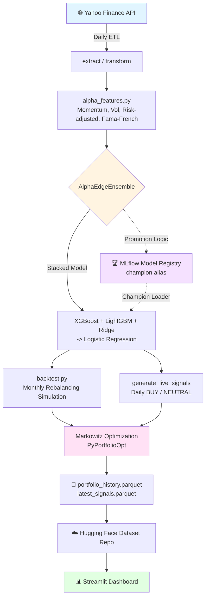

comporte toi comme étant un analyste financier a la BRVM :

2 pièces jointes
2 étapes terminées
Entendu. Je vais me positionner comme un analyste financier orienté BRVM.
À partir des documents joints, ma première lecture sur ERIUM CI est plutôt prudente à court terme: le momentum boursier reste bon, mais la lecture fondamentale 2025 montre une pression nette sur le résultat, la structure financière et la trésorerie.

Vue d'ensemble
ERIUM CI a clôturé à 2 575 FCFA le 29 juin 2026, en baisse de 1,90% sur la séance, tout en affichant une progression annuelle de 62,97%, ce qui la place parmi les plus fortes baisses du jour malgré une performance cumulée encore très solide.

Le marché BRVM reste porteur en toile de fond, avec un BRVM Composite à 450,04 points en hausse annuelle de 30,16%, tandis que le secteur industriel progresse de 68,19% sur un an.

Résultats 2025
Sur le plan opérationnel, ERIUM affiche une amélioration du résultat d’exploitation à 866,4 M FCFA contre 522,3 M FCFA un an plus tôt, et le résultat des activités ordinaires remonte à 552,4 M FCFA contre 247,2 M FCFA.

En revanche, le résultat net recule à 179,3 M FCFA contre 377,0 M FCFA en 2024, ce qui traduit une baisse d’environ 52%, pénalisée notamment par un résultat hors activités ordinaires devenu négatif à -114,0 M FCFA après +316,2 M FCFA, ainsi que par un résultat financier toujours déficitaire à -314,0 M FCFA.

Bilan et liquidité
Les capitaux propres ressortent à 2,53 Md FCFA contre 3,27 Md FCFA un an plus tôt, alors que le total bilan monte à 14,61 Md FCFA contre 14,02 Md FCFA, ce qui signale un levier plus tendu.

La société conserve en plus une trésorerie nette négative à -1,66 Md FCFA à fin 2025, même si elle s’améliore par rapport à -2,14 Md FCFA à l’ouverture de l’exercice; les flux opérationnels restent positifs à 992,3 M FCFA, mais ils ont été insuffisants pour couvrir des flux d’investissement de -1,93 Md FCFA sans recours au financement externe.

Lecture boursière
Le titre reste soutenu par la dynamique sectorielle et par sa hausse annuelle, mais la baisse du bénéfice net et la trésorerie encore négative limitent, selon moi, la capacité à justifier une revalorisation purement fondamentale à très court terme.

En langage BRVM, je classerais donc ERIUM CI en conserver / surveiller, avec trois points de contrôle prioritaires: normalisation du résultat net, réduction de la dette de trésorerie et confirmation que les investissements 2025 commencent à produire un rendement visible en 2026.

Angle BRVM
Si tu veux que je reste dans ce rôle, je peux désormais te répondre sous le format d’une note de broker BRVM: thèse d’investissement, risques, catalyseurs, lecture des états financiers, et avis achat / conserver / vendre fondé sur les publications et la cote.
Tu veux que je commence par une note d’initiation complète sur ERIUM CI, ou par une comparaison ERIUM CI vs autres industrielles cotées à la BRVM ?

Préparé avec GPT-5.4 Thinking
et cette analyse N BRVM : Erium Côte d’Ivoire accélère ses investissements, tandis que son bénéfice net est divisé par deux
Publié le 29/06/2026 à 16h43


Erium Côte d'Ivoire, anciennement filiale du Groupe Air Liquide et spécialisée dans la production et la distribution de gaz industriels et médicaux, a engagé en 2025 un vaste programme d'investissements, mobilisant près de 2 milliards de FCFA pour moderniser son outil de production, selon ses états financiers arrêtés au 31 décembre 2025. La société cotée à la Bourse régionale des valeurs mobilières (BRVM) a enregistré un chiffre d'affaires en hausse de 8,5%, à 10,07 milliards de FCFA, mais son bénéfice net a été divisé par deux sur l'exercice.
 
Des investissements industriels en forte accélération
Au cours de l'exercice clos le 31 décembre 2025, les immobilisations corporelles ont progressé de 16%, passant de 7,40 milliards à 8,59 milliards de FCFA. Cette évolution traduit les investissements réalisés dans les équipements industriels, qui représentent désormais 7,72 milliards de FCFA de l'actif immobilisé, contre 6,51 milliards de FCFA un an auparavant.
 
Le tableau des flux de trésorerie confirme l'ampleur de cet effort. Les décaissements consacrés à l'acquisition d'immobilisations corporelles se sont élevés à 1,93 milliard de FCFA en 2025, contre 1,11 milliard de FCFA en 2024, soit une progression de près de 74 %.

A lire aussi : BRVM - Semaine 26 : AGL CI confirme sa dynamique haussière, tandis que Filtisac poursuit sa dégringolade
 
La dette bancaire devient le principal levier de financement
Pour soutenir cette montée en puissance, Erium a fortement accru son recours aux financements bancaires. Les emprunts et dettes financières diverses ont atteint 4,06 milliards de FCFA à fin décembre 2025, contre seulement 424,9 millions de FCFA un an plus tôt. Au total, les dettes financières et ressources assimilées s'élèvent désormais à 4,16 milliards de FCFA, contre 550,9 millions de FCFA en 2024.
 
Cette évolution traduit une profonde transformation de la structure financière de l'entreprise. Les ressources stables progressent à 6,69 milliards de FCFA, contre 3,82 milliards de FCFA un an auparavant, tandis que les capitaux propres reculent de 22,7%, à 2,53 milliards de FCFA, contre 3,27 milliards de FCFA en 2024. L'entreprise finance ainsi une part importante de son développement par l'endettement.
 
Ce refinancement a également permis de réduire le passif circulant, les dettes à court terme, de 8 à 6,2 milliards FCFA, améliorant structurellement l'équilibre du bilan.
 
Une activité commerciale toujours bien orientée
Cette stratégie d'investissement s'inscrit dans un contexte de croissance de l'activité. Le chiffre d'affaires a progressé de 8,5%, à 10,07 milliards de FCFA, contre 9,28 milliards de FCFA en 2024, porté à la fois par les ventes de produits fabriqués, qui atteignent 4,42 milliards de FCFA, et par les prestations de services, en hausse à 3,35 milliards de FCFA. Les ventes de marchandises demeurent également soutenues, à 2,31 milliards de FCFA.
 
Cette dynamique commerciale s'est traduite par une nette amélioration de la performance opérationnelle. Le résultat d'exploitation a bondi de 65,9%, à 866,4 millions de FCFA, contre 522,3 millions de FCFA un an auparavant. Malgré la hausse des charges de transport, des services extérieurs et des dépenses de personnel, l'entreprise est parvenue à améliorer la rentabilité de son activité.
 
L'entreprise a par ailleurs généré 992,3 millions de FCFA de flux nets de trésorerie issus de ses activités opérationnelles. Cette capacité d'autofinancement, bien qu'en légère baisse par rapport à 2024, demeure solide et confirme que le cœur de métier continue de produire des liquidités.
 
En outre, la capacité d'autofinancement globale, qui mesure la richesse qu'une société produit d'elle-même, lui permettant de se financer sans dépendre de l'aide de tiers, reste positive à 869 millions FCFA, même si elle recule de 15% sous l'effet de la charge fiscale.

A lire aussi : « Swap dette-énergie », la Zambie convertit sa dette en investissements énergétiques
 
Un bénéfice divisé par deux, reflet des arbitrages comptables
Le résultat net de l'exercice ressort à 179 millions de FCFA, contre 377 millions de FCFA en 2024. Ce recul de 52,5% ne reflète pas une dégradation de l'activité, mais essentiellement deux effets non récurrents. Ce recul s'explique principalement par la dégradation du résultat financier, conséquence de l'alourdissement de la dette contractée pour financer les investissements. Les charges financières ont augmenté de 27,9%, passant de 288,2 millions à 368,7 millions de FCFA, tandis que le résultat financier est resté déficitaire à 313,9 millions de FCFA. En dépit d'une activité plus dynamique et d'un résultat d'exploitation en forte progression, le coût du financement a ainsi pesé sur la rentabilité finale de l'entreprise.
 
Dans le même temps, la trésorerie reste sous tension. Bien que la trésorerie nette se soit améliorée, passant de -2,14 milliards à -1,66 milliard de FCFA, les disponibilités restent limitées à 48,2 millions de FCFA, alors que les dettes bancaires de trésorerie atteignent encore 1,71 milliard de FCFA.


 
Une stratégie tournée vers la croissance
Les comptes 2025 témoignent d'une entreprise engagée dans une nouvelle phase de développement industriel. La progression simultanée des investissements, des immobilisations et de l'endettement laisse penser qu'ERIUM prépare une montée en capacité afin de répondre à une demande croissante sur ses marchés.
 
Le principal défi des prochaines années sera désormais de transformer ces investissements en hausse des volumes de production, en amélioration des marges et en génération de flux de trésorerie suffisants. Cette montée en puissance devra permettre de réduire progressivement le poids de la dette, de renforcer la solidité financière de l'entreprise et, surtout, de restaurer une croissance durable de sa rentabilité.
 
Performance de l’action Erium à la BRVM
En 2025, le titre Erium CI a été l'une des valeurs vedettes de la BRVM, bondissant de 500 FCFA à 1 580 FCFA (+216 %), portée par le changement d'actionnaire, la nouvelle stratégie de croissance et un regain d'intérêt des investisseurs. En 2026, le titre a prolongé son mouvement jusqu'à un sommet de 3 215 FCFA avant de consolider autour de 2 575 FCFA (+62,97 % depuis le 1er janvier). D'un point de vue technique, le graphique montre une tendance haussière de fond toujours intacte, malgré une phase de consolidation et un recul des volumes après le pic de décembre-février, signe d'une prise de bénéfices plutôt que d'un retournement de tendance.

Oui, l’angle général de cette analyse est globalement juste: ERIUM CI investit fortement, son activité progresse, mais le bénéfice net 2025 a bien été divisé par deux sous l’effet combiné d’un coût de financement plus lourd et d’un fort retournement du hors activité ordinaire.

En revanche, certaines formulations méritent d’être resserrées, surtout quand elles attribuent la baisse du résultat net principalement à la dette sans assez insister sur la dégradation du résultat hors activités ordinaires.

Vérification rapide
Le chiffre d’affaires ressort bien à 10,07 milliards FCFA en 2025 contre 9,28 milliards FCFA en 2024, soit une hausse d’environ 8,5%.

Le résultat d’exploitation monte à 866,4 millions FCFA contre 522,3 millions FCFA, tandis que le résultat net recule à 179,3 millions FCFA contre 377,0 millions FCFA.

Au bilan, les emprunts et dettes financières diverses passent bien de 424,9 millions FCFA à 4,06 milliards FCFA, les dettes financières et ressources assimilées de 550,9 millions FCFA à 4,16 milliards FCFA, et les capitaux propres reculent de 3,27 milliards FCFA à 2,53 milliards FCFA.

Points confirmés
Point de l’analyse	Appréciation
“Les investissements accélèrent”	Confirmé par les flux d’investissement corporel: 1,93 milliard FCFA en 2025 contre 1,11 milliard FCFA en 2024. 
“La dette bancaire devient le principal levier”	Confirmé par la hausse des emprunts et dettes financières diverses à 4,06 milliards FCFA contre 424,9 millions FCFA un an plus tôt. 
“Le passif circulant baisse”	Confirmé: le passif circulant ressort à 6,21 milliards FCFA contre 8,00 milliards FCFA. 
“L’activité commerciale reste bien orientée”	Confirmé par la hausse du chiffre d’affaires à 10,07 milliards FCFA et du résultat d’exploitation à 866,4 millions FCFA. 
“La trésorerie reste tendue”	Confirmé: la trésorerie nette reste négative à -1,66 milliard FCFA, avec seulement 48,2 millions FCFA de trésorerie-actif contre 1,71 milliard FCFA de trésorerie-passif. 
“Le titre reste fort en Bourse”	Confirmé sur la séance du 29 juin 2026: ERIUM clôture à 2 575 FCFA, en baisse de 1,90% sur le jour mais en hausse de 62,97% sur l’année. 
Nuances importantes
La phrase la plus discutable est celle qui laisse entendre que la baisse du bénéfice net s’explique surtout par la dette et les charges financières.

En réalité, le résultat financier se dégrade de -275,1 millions FCFA à -314,0 millions FCFA, mais surtout le résultat hors activités ordinaires bascule de +316,2 millions FCFA à -114,0 millions FCFA, soit un retournement d’environ 430 millions FCFA.

Autrement dit, la progression du résultat d’exploitation et du résultat des activités ordinaires a bien eu lieu, mais elle a été plus que compensée par le poids du financier et, surtout, par le choc sur le hors ordinaire.

Lecture BRVM
En langage de broker BRVM, je reformulerais donc la thèse ainsi: “croissance opérationnelle réelle, mais rentabilité nette encore fragile à cause du levier financier et d’éléments non opérationnels défavorables”.

Le marché semble pour l’instant valoriser le potentiel industriel et le changement de profil de la société plus que la rentabilité immédiate, ce qui est cohérent avec une performance boursière encore très positive en 2026 malgré le repli du jour.

La bonne question pour 2026 n’est pas de savoir si ERIUM a investi, car cela est déjà visible dans les comptes, mais si ces investissements vont transformer la hausse de capacité en flux de trésorerie récurrents et en désendettement progressif.

Je peux maintenant te faire soit une contre-analyse BRVM plus professionnelle de cet article, soit une note de recherche type SGI sur ERIUM CI avec recommandation: Achat, Conserver ou Alléger.

Préparé avec GPT-5.4 Thinking
oui

Voici une note de recherche type SGI / analyste BRVM sur ERIUM CI.

Recommandation
Je serais sur une recommandation Conserver / Achat spéculatif, pas encore sur un achat de conviction fondamental pur.

La thèse repose sur une croissance opérationnelle réelle et un cycle d’investissement visible, mais elle reste contrebalancée par une structure financière plus tendue, une trésorerie encore négative et un résultat net affaibli.

Thèse d'investissement
ERIUM CI a porté son chiffre d’affaires à 10,07 milliards FCFA en 2025 contre 9,28 milliards FCFA en 2024, tandis que le résultat d’exploitation a progressé à 866,4 millions FCFA contre 522,3 millions FCFA, ce qui valide une amélioration du cœur de métier.

En parallèle, la société a fortement investi, avec 1,93 milliard FCFA de décaissements sur les immobilisations corporelles contre 1,11 milliard FCFA un an plus tôt, ce qui suggère une montée en capacité industrielle.

Le marché continue d’anticiper ce changement de profil: au 29 juin 2026, le titre cote 2 575 FCFA, en baisse de 1,90% sur la séance mais en hausse de 62,97% depuis le début de l’année.

Risques majeurs
Le principal point de vigilance est le levier financier. Les emprunts et dettes financières diverses passent à 4,06 milliards FCFA contre 424,9 millions FCFA, et l’ensemble des dettes financières et ressources assimilées grimpe à 4,16 milliards FCFA contre 550,9 millions FCFA.

Dans le même temps, les capitaux propres reculent à 2,53 milliards FCFA contre 3,27 milliards FCFA, ce qui dégrade la flexibilité bilancielle.

La trésorerie nette demeure négative à -1,66 milliard FCFA à fin 2025, malgré une amélioration par rapport à -2,14 milliards FCFA, avec seulement 48,2 millions FCFA de trésorerie-actif face à 1,71 milliard FCFA de trésorerie-passif.

Lecture des résultats
Le résultat net ressort à 179,3 millions FCFA contre 377,0 millions FCFA, soit une division par deux environ.

Cette baisse n’annule pas l’amélioration opérationnelle, mais elle montre que la création de valeur pour l’actionnaire est encore fragile, car le résultat financier reste déficitaire à -314,0 millions FCFA et le résultat hors activités ordinaires bascule à -114,0 millions FCFA après +316,2 millions FCFA en 2024.

Autrement dit, ERIUM exécute bien sur l’exploitation, mais pas encore sur la conversion de cette dynamique en rentabilité nette stabilisée.

Catalyseurs boursiers
Les catalyseurs positifs pour le titre seraient une monétisation rapide des investissements 2025, une hausse visible des volumes ou des marges en 2026, et une normalisation du coût de financement.

À l’inverse, un maintien prolongé d’une trésorerie sous tension ou une nouvelle pression sur le résultat net pourrait justifier une consolidation plus marquée après le fort rerating déjà observé en Bourse.

Dans l’état actuel, ERIUM ressemble à une valeur de croissance industrielle en phase de transition, avec un potentiel réel mais un profil de risque supérieur à celui d’un dossier défensif BRVM.

Avis de broker
Mon avis serait donc: Conserver pour un investisseur déjà positionné, parce que la tendance de marché reste favorable et que le narratif industriel n’est pas cassé.

Pour une nouvelle entrée, je parlerais plutôt d’Achat spéculatif sur repli, car le marché a déjà largement pricé la transformation, alors que les comptes 2025 ne montrent pas encore une pleine traduction en bénéfice net et en cash-flow disponible.

Je peux maintenant te rédiger cela dans un format encore plus professionnel, soit en fiche d’initiation de couverture, soit en note d’investissement BRVM d’une page.

Préparé avec GPT-5.4 Thinking
onyxia@vscode-python-102368-0:~/work/Gestion-portefeuille$ tree -I 'venv|__pycache__|.git|node_modules' -a
bash: tree: command not found
onyxia@vscode-python-102368-0:~/work/Gestion-portefeuille$

tree n'est pas installé sur cet environnement. Voici trois façons de contourner le problème, de la plus simple à la plus universelle.

Option 1 — Installer tree (si vous avez les droits sudo)
bash
sudo apt-get update && sudo apt-get install -y tree
Puis relancez votre commande :

bash
tree -I 'venv|__pycache__|.git|node_modules|.ipynb_checkpoints' -a
Option 2 — Utiliser find (toujours disponible, pas besoin d'installer quoi que ce soit)
bash
find . -path ./venv -prune -o -path ./.git -prune -o -path '*/__pycache__' -prune -o -print | sed -e 's;[^/]*/;│   ;g;s;│   \([^│]\);├── \1;'
C'est moins joli que tree mais ça fonctionne partout sans dépendance.

Option 3 — Générer l'arborescence avec Python (la plus fiable, garantit un rendu propre)
Créez un petit script gen_tree.py :

python
import os

IGNORE = {'.git', '__pycache__', 'venv', 'node_modules', '.ipynb_checkpoints'}

def print_tree(root, prefix=""):
    entries = sorted(e for e in os.listdir(root) if e not in IGNORE)
    entries = [e for e in entries if not e.startswith('.') or e in ('.github',)]
    for i, entry in enumerate(entries):
        path = os.path.join(root, entry)
        connector = "└── " if i == len(entries) - 1 else "├── "
        print(prefix + connector + entry)
        if os.path.isdir(path):
            extension = "    " if i == len(entries) - 1 else "│   "
            print_tree(path, prefix + extension)

print_tree(".")
Exécutez-le :

bash
python3 gen_tree.py > structure.txt
cat structure.txt
Ensuite copiez le contenu de structure.txt directement dans votre README.md, entre trois backticks, en éditant le fichier dans VS Code (pas via le chat) pour éviter toute perte de formatage :

text
## 📂 Project Structure
(collez ici le contenu de structure.txt)

text
Cette méthode génère une arborescence réelle basée sur vos fichiers actuels, avec les bons caractères et les bons retours à la ligne garantis — plus besoin de copier-coller mon texte depuis le chat. Voulez-vous que j'ajuste le script Python pour qu'il affiche aussi automatiquement les commentaires # à côté de chaque fichier connu (comme daily_run.yml # Automated daily execution) ?

Préparé avec Claude Sonnet 5.0 Thinking
et n ow ?? <div align="center">


# 📈 AlphaEdge: AI-Powered Multi-Market Portfolio Manager


**Production-Ready Quantitative Trading System with Daily MLOps Pipeline**


Combining Gradient Boosting Ensembles, Market Regime Detection & Modern Portfolio Theory for Automated Asset Allocation across CAC40, US Tech and BRVM


!Daily Pipeline


🌐 **Live Dashboard** • 📊 **Performance** • 🏗️ **Architecture** • 🚀 **Quick Start** • 🐛 **Report Issue**


</div>


---


## 🎯 Why AlphaEdge?


Traditional portfolio management relies on static allocations and reactive rebalancing. **AlphaEdge** flips this paradigm by implementing a **fully automated, multi-market AI-driven investment strategy** that:


- 🌍 **Runs across multiple markets** (CAC40, US Tech, BRVM) from a single codebase, driven by JSON configs
- 🔄 **Rebalances monthly** based on model conviction, with daily live signal generation
- 🤖 **Requires zero manual intervention** through GitHub Actions automation
- 🏆 **Self-governs its own model deployment** via an MLflow champion/challenger promotion system
- 🎓 **Built on academic rigor** from quantitative finance research (Markowitz, Ledoit-Wolf, Fama-French)


> **Perfect for:** Quantitative researchers, algo traders, data scientists, and finance students looking to deploy production-grade ML strategies.


---


## 🌟 Key Features


### 🧠 Ensemble AI Architecture
- **Gradient Boosting Ensemble:** XGBoost + LightGBM + Ridge, stacked via Logistic Regression, predicts 1-month upside probability per stock
- **Market Regime Detection:** K-Means clustering on RSI-based features to characterize the current market state
- **Walk-Forward Validation:** stability of AUC/APR is checked across 4 rolling time windows before trusting a model


### ⚖️ Advanced Portfolio Optimization
- **Markowitz Mean-Variance Framework** with Ledoit-Wolf covariance shrinkage (`PyPortfolioOpt`)
- **Max Sharpe objective** with L2 regularization, falling back to equal-weight when too few assets qualify
- **Transaction cost & turnover modeling** applied at every monthly rebalance


### ☁️ Production-Grade MLOps
- **MLflow Model Registry** with a `champion` alias: every new training run is only promoted if it beats the current champion on Sortino ratio without degrading Max Drawdown by more than 2%
- **Hard safety thresholds** (`SHARPE_THRESHOLD`, `MAX_DD_THRESHOLD`) that block promotion of any model that is not financially sound, regardless of ML metrics
- **Local fallback** (`ensemble_model.pkl` + `model_card.json`) if MLflow / `HF_TOKEN` is unavailable, so the daily pipeline never fully breaks
- **Automated daily ETL + backtest + signal generation** via GitHub Actions, with results synced to a Hugging Face dataset repo


### 📊 Interactive Analytics (Streamlit)
- Real-time performance tracking vs each market's benchmark, with zoomable time ranges
- Daily BUY/NEUTRAL signal table with allocation weights and upside probability
- Drawdown chart, recovery time, and full period-return breakdown (1M/3M/6M/YTD/1Y)
- Live candlestick explorer per ticker (yfinance) and model performance / feature importance tab


---


## 📸 Dashboard Preview


<div align="center">


| **Portfolio Performance** | **AI Trading Signals** |
|:---:|:---:|
| !Dashboard Overview | !Trading Signals |


*Live tracking of cumulative returns, Sharpe ratio, and maximum drawdown (left). Daily probabilistic forecasts with market regime indicators (right).*


</div>


---


## 📊 Performance Metrics (Live & Backtest)


Data updated as of: **2026-02-05**


| Metric | AlphaEdge Strategy 🤖 | CAC40 Benchmark 🇫🇷 |
| :--- | :---: | :---: |
| **Total Return** | **+121.9%** 🚀 | +87.9% |
| **Alpha (vs Bench)** | **+34.0%** | N/A |
| **YTD Performance** | **+9.5%** | TBD |
| **Sharpe Ratio** | **0.63** | N/A |
| **Max Drawdown** | **-32.0%** | TBD |


> **Note:** Figures above cover the CAC40 market. Other configured markets (US Tech, BRVM) have independent metrics, viewable per-market on the live dashboard.


*Metrics updated daily. Benchmark curve now compounds correctly month-over-month (fixed in the latest backtest engine revision — see Changelog).*


---


## 🏗️ System Architecture


The entire pipeline runs autonomously with zero maintenance required, once configured.





### Pipeline Components


1. **ETL Layer** (`src/pipeline/etl.py`, `src/extract/`, `src/transform/`): fetches raw market data, handles ticker changes/delisting, and persists `daily_raw.parquet` / `monthly_features.parquet` per market
2. **Feature Store** (`src/features/alpha_features.py`): momentum, mean-reversion, volatility, risk-adjusted (Sharpe/Sortino/Calmar), tail-risk (VaR/CVaR), technical enrichment and Fama-French betas
3. **Math Utilities** (`src/utils/math_utils.py`): shared rolling-window statistics (`_safe_div`, `_rolling_sortino`, `_rolling_maxdrawdown`) used across features and metrics
4. **ML Model** (`src/models/ensemble.py`): `AlphaEdgeEnsemble`, trained and evaluated via `train.py`, with walk-forward validation
5. **Model Registry** (`src/models/model_loader.py`): resolves the active "champion" model, MLflow-first with local pickle fallback
6. **Backtest & Signal Engine** (`src/pipeline/backtest.py`): monthly rebalancing simulation + daily live signal scoring
7. **Orchestrator** (`daily_run.py`): runs the full ETL → backtest → signals → upload cycle per market, defined in `config/markets/*.json`
8. **Dashboard** (`app.py`): Streamlit app reading synced parquet files from Hugging Face, with per-market navigation


---


## 🚀 Quick Start


### Prerequisites


- Python 3.10 or higher
- Git installed
- (Optional) `HF_TOKEN` environment variable for MLflow tracking and Hugging Face dataset sync


### Installation


```bash
# Clone the repository
git clone https://github.com/SORADATA/CAC40-Quantitative-Analysis-Predictive-Asset-Allocation.git
cd CAC40-Quantitative-Analysis-Predictive-Asset-Allocation


# Create virtual environment (recommended)
python -m venv venv
source venv/bin/activate  # On Windows: venv\Scripts\activate


# Install dependencies
pip install -r requirements.txt


# (Optional) configure environment variables
cp .env.example .env
# then edit .env and set HF_TOKEN, HF_REPO_ID
```


### Running Locally


**Option 1 — Launch the dashboard**
```bash
streamlit run app.py
```
Opens the interactive multi-market dashboard at `http://localhost:8501`.


**Option 2 — Run the full daily pipeline**
```bash
python daily_run.py
```
Executes ETL → backtest → live signal generation → (optional) Hugging Face sync, for every market defined in `config/markets/`.


**Option 3 — Train / retrain a model**
```bash
python train.py
```
Trains `AlphaEdgeEnsemble` for every configured market, runs walk-forward validation, and (if `HF_TOKEN` is set) evaluates promotion to MLflow `champion`.


---
## 📂 Project Structure


├── .github
│   └── workflows
│       ├── daily_update.yml
│       ├── ml_pipeline.yml
│       ├── pre-release.yml
│       ├── python-app.yml
│       └── release.yml
├── CHANGELOG.md
├── CONTRIBUTING.md
├── README.md
├── app.py
├── config
│   └── markets
│       └── cac40.json
├── const.py
├── debug_run.txt
├── dev.sh
├── gen_tree.py
├── images
│   ├── Dashboard.png
│   └── Signal.png
├── notebooks
│   └── 01_EDA.ipynb
├── requirements.txt
├── src
│   ├── extract
│   │   ├── extractor.py
│   │   └── yfinance_downloader_test.py
│   ├── features
│   │   └── alpha_features.py
│   ├── models
│   │   ├── CAC40
│   │   │   ├── ensemble_model.pkl
│   │   │   └── model_card.json
│   │   ├── US_TECH
│   │   │   ├── ensemble_model.pkl
│   │   │   └── model_card.json
│   │   ├── __init__.py
│   │   ├── cv.py
│   │   ├── ensemble.py
│   │   ├── ensemble_model.pkl
│   │   ├── model_card.json
│   │   ├── model_loader.py
│   │   └── train.py
│   ├── pipeline
│   │   ├── backtest.py
│   │   ├── daily_run.py
│   │   └── etl.py
│   ├── transform
│   │   ├── processor.py
│   │   └── ticker_manager.py
│   └── utils
│       ├── config_loader.py
│       ├── feature_utils.py
│       ├── logger.py
│       ├── market_utils.py
│       ├── math_utils.py
│       └── metrics.py
├── structure.txt
└── tests
    ├── get_composition.py
    ├── plot_results.py
    └── test_pipeline.py


## 🔧 Customization Guide


### Adding a New Market


AlphaEdge is designed to scale to new markets without touching the core pipeline code.


1. **Fork this repository** (click the Fork button above)


2. **Add a new config file** in `config/markets/`, e.g. `config/markets/sp500.json`:
```json
{
    "market_name": "SP500",
    "tickers": ["AAPL", "MSFT", "GOOGL", "AMZN", "NVDA"],
    "benchmark_ticker": "^GSPC"
}
```


3. **Train the model** for the new market:
```bash
python train.py
```
This automatically discovers every config file in `config/markets/` and trains one `AlphaEdgeEnsemble` per market.


4. **Run the daily pipeline** — `daily_run.py` will iterate over all configured markets, backtest, generate signals, and sync results.


5. **Push changes** — the dashboard's market selector auto-discovers new markets from the Hugging Face dataset repo, no dashboard code change required.


### Tuning Key Parameters


Central configuration lives in `const.py`:


| Parameter | Description | Notes |
|-----------|-------------|-------|
| `SHARPE_THRESHOLD` | Minimum Sharpe ratio required for MLflow promotion | Hard safety gate |
| `MAX_DD_THRESHOLD` | Minimum (least negative) Max Drawdown required for promotion | Hard safety gate |
| `PROBA_MIN` | Minimum predicted upside probability to consider a stock | Filters the investable universe monthly |
| `MAX_STOCKS_SELECT` | Maximum number of stocks held per rebalance | Controls concentration |
| `MIN_STOCKS_OPTIM` | Minimum stocks required to run Markowitz (else equal-weight) | Stability fallback |
| `TRANSACTION_COST` | Cost applied to portfolio turnover at each rebalance | Realism of backtest |
| `BACKTEST_YEARS` | Lookback window for the daily backtest | Data volume vs relevance trade-off |


---


## 📚 Technical Deep Dive


### Feature Engineering (`src/features/alpha_features.py`)


The model uses features across several categories, computed per ticker via rolling windows:


- **Momentum:** multi-horizon returns (1/2/3/6/9/12 months), momentum spreads (`mom_12_1`, `mom_6_1`)
- **Mean-Reversion:** price z-score vs 12-month moving average, nearness to 52-week high
- **Volatility:** realized volatility (3m/12m), volatility ratio, idiosyncratic volatility vs market factor
- **Risk-Adjusted:** rolling Sharpe (3m/6m), rolling Sortino (6m), Calmar proxy
- **Tail Risk:** rolling skew/kurtosis, historical VaR (5%), CVaR (5%)
- **Technical Enrichment:** RSI divergence, Amihud illiquidity, volume trend & z-score
- **Fama-French:** rolling 5-factor betas (Europe factors) via `RollingOLS`
- **Seasonality:** cyclical month encoding, quarter-end and January flags
- **Cross-Sectional Ranks:** percentile rank of key factors within each month


> ⚠️ Rolling-window features require sufficient historical depth (up to 12 months) to be reliable. The backtest engine explicitly excludes months with insufficient per-ticker history rather than silently scoring on zero-filled features — see Changelog.


### Model Training (`train.py`)


**AlphaEdgeEnsemble:**
- Binary classification target: next-month price direction (up/down)
- Stacked architecture: XGBoost + LightGBM + Ridge → Logistic Regression meta-learner
- Hyperparameter tuning via Optuna (50 trials for the final model, 20 for walk-forward windows)
- Evaluated via AUC / Average Precision on a held-out 6-month test window


**Walk-Forward Validation:**
- 4 rolling windows of 3 months each, re-trained independently, to check temporal stability of AUC before trusting the final model


**MLflow Champion/Challenger:**
- Every training run is logged to MLflow with ML metrics (AUC) and financial metrics (Sharpe, Sortino, Calmar, Max Drawdown)
- A challenger is promoted to `champion` only if it clears absolute safety thresholds **and** improves Sortino ratio without degrading Max Drawdown by more than 2% vs the current champion


### Portfolio Optimization (`src/pipeline/backtest.py`)


Implements **Markowitz Mean-Variance Optimization** via `PyPortfolioOpt`:
- Expected returns via **EMA historical return** (252-day span)
- Covariance matrix via **Ledoit-Wolf shrinkage** (addresses estimation error)
- Objective: **Maximize Sharpe ratio** with L2 regularization to avoid concentrated weights
- Fallback to **equal-weight** allocation when fewer than `MIN_STOCKS_OPTIM` assets qualify, or when the optimizer fails to converge
- Monthly rebalancing with **turnover-based transaction costs**, and a benchmark curve that compounds continuously across the full backtest window


---


## 🤝 Contributing


Contributions are welcome! Here's how you can help:


1. **Report bugs** via GitHub Issues
2. **Suggest features** in the Discussions tab
3. **Submit pull requests** following the code style guidelines below


### Development Setup


```bash
# Install development dependencies
pip install -r requirements-dev.txt


# Run linting
black src/ --check
flake8 src/


# Run tests
pytest tests/
```


---


## 📖 Research & References


This project builds upon:


- Markowitz, H. (1952). "Portfolio Selection". *Journal of Finance*
- Friedman, J. et al. (2001). "Greedy Function Approximation: A Gradient Boosting Machine"
- Ledoit, O. & Wolf, M. (2004). "Honey, I Shrunk the Sample Covariance Matrix"
- Fama, E. & French, K. (2015). "A Five-Factor Asset Pricing Model". *Journal of Financial Economics*
- Bailey, D. et al. (2017). "Stock Portfolio Design and Backtest Overfitting". *Journal of Investment Management*


---


## ⚠️ Disclaimer


**This project is for educational and research purposes only.**


- ❌ Not financial advice or investment recommendations
- ❌ No guarantee of profitability or performance
- ❌ Past results do not predict future outcomes
- ⚠️ Algorithmic trading involves substantial risk of capital loss


Always consult with a licensed financial advisor before making investment decisions.


---


## 📜 License


This project is licensed under the **MIT License** - see the LICENSE file for details.


You are free to use, modify, and distribute this code with attribution.


---


## 🙏 Acknowledgments


Developed as part of the **Master 2 - Statistics Expertise for Finance & Economics** program at **Université de Lorraine**.


Special thanks to:
- The open-source community for libraries (Streamlit, scikit-learn, XGBoost, LightGBM, PyPortfolioOpt, MLflow)
- Publicly available market data providers powering this research


---


<div align="center">


### 💡 Found this useful?


⭐ **Star this repo** to show support!


🔀 **Fork it** to build your own strategy!


📢 **Share it** with fellow quants and developers!


---


**Developed by SORADATA**


</div>

Progrès net : l'arborescence est maintenant réelle et générée depuis votre projet, avec les bons retours à la ligne. Mais deux problèmes restent à corriger avant que ce soit "top".

Problème 1 — Toujours pas de balises de bloc de code
Dans le texte que vous avez collé, la section ressemble à :

text
## 📂 Project Structure

├── .github
│   └── workflows
...
Il manque encore les trois backticks avant ├── .github et après test_pipeline.py. Sans elles, l'indentation risque à nouveau de se déformer au rendu GitHub. Ajoutez-les ainsi :

text
## 📂 Project Structure
├── .github
│ └── workflows
│ ├── daily_update.yml
│ ├── ml_pipeline.yml
│ ├── pre-release.yml
│ ├── python-app.yml
│ └── release.yml
├── CHANGELOG.md
├── CONTRIBUTING.md
├── README.md
├── app.py
├── config
│ └── markets
│ └── cac40.json
├── const.py
├── debug_run.txt
├── dev.sh
├── gen_tree.py
├── images
│ ├── Dashboard.png
│ └── Signal.png
├── notebooks
│ └── 01_EDA.ipynb
├── requirements.txt
├── src
│ ├── extract
│ │ ├── extractor.py
│ │ └── yfinance_downloader_test.py
│ ├── features
│ │ └── alpha_features.py
│ ├── models
│ │ ├── CAC40
│ │ │ ├── ensemble_model.pkl
│ │ │ └── model_card.json
│ │ ├── US_TECH
│ │ │ ├── ensemble_model.pkl
│ │ │ └── model_card.json
│ │ ├── _init_.py
│ │ ├── cv.py
│ │ ├── ensemble.py
│ │ ├── ensemble_model.pkl
│ │ ├── model_card.json
│ │ ├── model_loader.py
│ │ └── train.py
│ ├── pipeline
│ │ ├── backtest.py
│ │ ├── daily_run.py
│ │ └── etl.py
│ ├── transform
│ │ ├── processor.py
│ │ └── ticker_manager.py
│ └── utils
│ ├── config_loader.py
│ ├── feature_utils.py
│ ├── logger.py
│ ├── market_utils.py
│ ├── math_utils.py
│ └── metrics.py
├── structure.txt
└── tests
├── get_composition.py
├── plot_results.py
└── test_pipeline.py

text
Problème 2 — Incohérences entre la structure réelle et le reste du README
Votre arborescence générée révèle des différences importantes avec ce que décrit le reste du README, à corriger pour que le document reste cohérent :

Élément décrit dans le README	Réalité dans votre structure
daily_run.py à la racine	En réalité dans src/pipeline/daily_run.py
LICENSE présent	Absent de l'arborescence générée
.env.example présent	Absent de l'arborescence générée
requirements-dev.txt (section Contributing)	Absent de l'arborescence générée
models/<MARKET>/ uniquement	Il y a aussi un ensemble_model.pkl et model_card.json orphelins directement dans src/models/
Un seul marché configuré	Seul cac40.json existe dans config/markets/, pas us_tech.json ni brvm.json
market_utils.py référencé pour tous les marchés	Cohérent, mais le multi-marché US Tech/BRVM semble non encore déployé en code
Deux options pour régler ça :

Mettre à jour le README pour refléter l'état réel actuel du projet (un seul marché CAC40 pour l'instant, daily_run.py dans src/pipeline/, pas de LICENSE/.env.example pour le moment).

Compléter le projet pour qu'il corresponde au README (ajouter LICENSE, .env.example, déplacer ou dupliquer les commandes daily_run.py à la racine si c'est le point d'entrée voulu, ajouter les configs us_tech.json/brvm.json).

Voulez-vous que je vous prépare une version du README alignée sur la structure réelle actuelle (option 1), ou préférez-vous d'abord compléter les fichiers manquants dans le projet ?

Préparé avec Claude Sonnet 5.0 Thinking
rends propre ce readme et donne un fichier telechargeable directement ounun fichier markdown pas de copier coller : <div align="center">


# 📈 AlphaEdge: AI-Powered Multi-Market Portfolio Manager


**Production-Ready Quantitative Trading System with Daily MLOps Pipeline**


Combining Gradient Boosting Ensembles, Market Regime Detection & Modern Portfolio Theory for Automated Asset Allocation across CAC40, US Tech and BRVM


!Daily Pipeline


🌐 **Live Dashboard** • 📊 **Performance** • 🏗️ **Architecture** • 🚀 **Quick Start** • 🐛 **Report Issue**


</div>


---


## 🎯 Why AlphaEdge?


Traditional portfolio management relies on static allocations and reactive rebalancing. **AlphaEdge** flips this paradigm by implementing a **fully automated, multi-market AI-driven investment strategy** that:


- 🌍 **Runs across multiple markets** (CAC40, US Tech, BRVM) from a single codebase, driven by JSON configs
- 🔄 **Rebalances monthly** based on model conviction, with daily live signal generation
- 🤖 **Requires zero manual intervention** through GitHub Actions automation
- 🏆 **Self-governs its own model deployment** via an MLflow champion/challenger promotion system
- 🎓 **Built on academic rigor** from quantitative finance research (Markowitz, Ledoit-Wolf, Fama-French)


> **Perfect for:** Quantitative researchers, algo traders, data scientists, and finance students looking to deploy production-grade ML strategies.


---


## 🌟 Key Features


### 🧠 Ensemble AI Architecture
- **Gradient Boosting Ensemble:** XGBoost + LightGBM + Ridge, stacked via Logistic Regression, predicts 1-month upside probability per stock
- **Market Regime Detection:** K-Means clustering on RSI-based features to characterize the current market state
- **Walk-Forward Validation:** stability of AUC/APR is checked across 4 rolling time windows before trusting a model


### ⚖️ Advanced Portfolio Optimization
- **Markowitz Mean-Variance Framework** with Ledoit-Wolf covariance shrinkage (`PyPortfolioOpt`)
- **Max Sharpe objective** with L2 regularization, falling back to equal-weight when too few assets qualify
- **Transaction cost & turnover modeling** applied at every monthly rebalance


### ☁️ Production-Grade MLOps
- **MLflow Model Registry** with a `champion` alias: every new training run is only promoted if it beats the current champion on Sortino ratio without degrading Max Drawdown by more than 2%
- **Hard safety thresholds** (`SHARPE_THRESHOLD`, `MAX_DD_THRESHOLD`) that block promotion of any model that is not financially sound, regardless of ML metrics
- **Local fallback** (`ensemble_model.pkl` + `model_card.json`) if MLflow / `HF_TOKEN` is unavailable, so the daily pipeline never fully breaks
- **Automated daily ETL + backtest + signal generation** via GitHub Actions, with results synced to a Hugging Face dataset repo


### 📊 Interactive Analytics (Streamlit)
- Real-time performance tracking vs each market's benchmark, with zoomable time ranges
- Daily BUY/NEUTRAL signal table with allocation weights and upside probability
- Drawdown chart, recovery time, and full period-return breakdown (1M/3M/6M/YTD/1Y)
- Live candlestick explorer per ticker (yfinance) and model performance / feature importance tab


---


## 📸 Dashboard Preview


<div align="center">


| **Portfolio Performance** | **AI Trading Signals** |
|:---:|:---:|
| !Dashboard Overview | !Trading Signals |


*Live tracking of cumulative returns, Sharpe ratio, and maximum drawdown (left). Daily probabilistic forecasts with market regime indicators (right).*


</div>


---


## 📊 Performance Metrics (Live & Backtest)


Data updated as of: **2026-02-05**


| Metric | AlphaEdge Strategy 🤖 | CAC40 Benchmark 🇫🇷 |
| :--- | :---: | :---: |
| **Total Return** | **+121.9%** 🚀 | +87.9% |
| **Alpha (vs Bench)** | **+34.0%** | N/A |
| **YTD Performance** | **+9.5%** | TBD |
| **Sharpe Ratio** | **0.63** | N/A |
| **Max Drawdown** | **-32.0%** | TBD |


> **Note:** Figures above cover the CAC40 market. Other configured markets (US Tech, BRVM) have independent metrics, viewable per-market on the live dashboard.


*Metrics updated daily. Benchmark curve now compounds correctly month-over-month (fixed in the latest backtest engine revision — see Changelog).*


---


## 🏗️ System Architecture


The entire pipeline runs autonomously with zero maintenance required, once configured.


### Pipeline Components


1. **ETL Layer** (`src/pipeline/etl.py`, `src/extract/`, `src/transform/`): fetches raw market data, handles ticker changes/delisting, and persists `daily_raw.parquet` / `monthly_features.parquet` per market
2. **Feature Store** (`src/features/alpha_features.py`): momentum, mean-reversion, volatility, risk-adjusted (Sharpe/Sortino/Calmar), tail-risk (VaR/CVaR), technical enrichment and Fama-French betas
3. **Math Utilities** (`src/utils/math_utils.py`): shared rolling-window statistics (`_safe_div`, `_rolling_sortino`, `_rolling_maxdrawdown`) used across features and metrics
4. **ML Model** (`src/models/ensemble.py`): `AlphaEdgeEnsemble`, trained and evaluated via `train.py`, with walk-forward validation
5. **Model Registry** (`src/models/model_loader.py`): resolves the active "champion" model, MLflow-first with local pickle fallback
6. **Backtest & Signal Engine** (`src/pipeline/backtest.py`): monthly rebalancing simulation + daily live signal scoring
7. **Orchestrator** (`daily_run.py`): runs the full ETL → backtest → signals → upload cycle per market, defined in `config/markets/*.json`
8. **Dashboard** (`app.py`): Streamlit app reading synced parquet files from Hugging Face, with per-market navigation


---


## 🚀 Quick Start


### Prerequisites


- Python 3.10 or higher
- Git installed
- (Optional) `HF_TOKEN` environment variable for MLflow tracking and Hugging Face dataset sync


### Installation


```bash
# Clone the repository
git clone https://github.com/SORADATA/CAC40-Quantitative-Analysis-Predictive-Asset-Allocation.git
cd CAC40-Quantitative-Analysis-Predictive-Asset-Allocation


# Create virtual environment (recommended)
python -m venv venv
source venv/bin/activate  # On Windows: venv\Scripts\activate


# Install dependencies
pip install -r requirements.txt


# (Optional) configure environment variables
cp .env.example .env
# then edit .env and set HF_TOKEN, HF_REPO_ID
```


### Running Locally


**Option 1 — Launch the dashboard**
```bash
streamlit run app.py
```
Opens the interactive multi-market dashboard at `http://localhost:8501`.


**Option 2 — Run the full daily pipeline**
```bash
python daily_run.py
```
Executes ETL → backtest → live signal generation → (optional) Hugging Face sync, for every market defined in `config/markets/`.


**Option 3 — Train / retrain a model**
```bash
python train.py
```
Trains `AlphaEdgeEnsemble` for every configured market, runs walk-forward validation, and (if `HF_TOKEN` is set) evaluates promotion to MLflow `champion`.


---
## 📂 Project Structure


├── .github
│   └── workflows
│       ├── daily_update.yml
│       ├── ml_pipeline.yml
│       ├── pre-release.yml
│       ├── python-app.yml
│       └── release.yml
├── CHANGELOG.md
├── CONTRIBUTING.md
├── README.md
├── app.py
├── config
│   └── markets
│       └── cac40.json
├── const.py
├── debug_run.txt
├── dev.sh
├── gen_tree.py
├── images
│   ├── Dashboard.png
│   └── Signal.png
├── notebooks
│   └── 01_EDA.ipynb
├── requirements.txt
├── src
│   ├── extract
│   │   ├── extractor.py
│   │   └── yfinance_downloader_test.py
│   ├── features
│   │   └── alpha_features.py
│   ├── models
│   │   ├── CAC40
│   │   │   ├── ensemble_model.pkl
│   │   │   └── model_card.json
│   │   ├── US_TECH
│   │   │   ├── ensemble_model.pkl
│   │   │   └── model_card.json
│   │   ├── __init__.py
│   │   ├── cv.py
│   │   ├── ensemble.py
│   │   ├── ensemble_model.pkl
│   │   ├── model_card.json
│   │   ├── model_loader.py
│   │   └── train.py
│   ├── pipeline
│   │   ├── backtest.py
│   │   ├── daily_run.py
│   │   └── etl.py
│   ├── transform
│   │   ├── processor.py
│   │   └── ticker_manager.py
│   └── utils
│       ├── config_loader.py
│       ├── feature_utils.py
│       ├── logger.py
│       ├── market_utils.py
│       ├── math_utils.py
│       └── metrics.py
├── structure.txt
└── tests
    ├── get_composition.py
    ├── plot_results.py
    └── test_pipeline.py


---


## 🔧 Customization Guide


### Adding a New Market


AlphaEdge is designed to scale to new markets without touching the core pipeline code.


1. **Fork this repository** (click the Fork button above)


2. **Add a new config file** in `config/markets/`, e.g. `config/markets/sp500.json`:
```json
{
    "market_name": "SP500",
    "tickers": ["AAPL", "MSFT", "GOOGL", "AMZN", "NVDA"],
    "benchmark_ticker": "^GSPC"
}
```


3. **Train the model** for the new market:
```bash
python train.py
```
This automatically discovers every config file in `config/markets/` and trains one `AlphaEdgeEnsemble` per market.


4. **Run the daily pipeline** — `daily_run.py` will iterate over all configured markets, backtest, generate signals, and sync results.


5. **Push changes** — the dashboard's market selector auto-discovers new markets from the Hugging Face dataset repo, no dashboard code change required.


### Tuning Key Parameters


Central configuration lives in `const.py`:


| Parameter | Description | Notes |
|-----------|-------------|-------|
| `SHARPE_THRESHOLD` | Minimum Sharpe ratio required for MLflow promotion | Hard safety gate |
| `MAX_DD_THRESHOLD` | Minimum (least negative) Max Drawdown required for promotion | Hard safety gate |
| `PROBA_MIN` | Minimum predicted upside probability to consider a stock | Filters the investable universe monthly |
| `MAX_STOCKS_SELECT` | Maximum number of stocks held per rebalance | Controls concentration |
| `MIN_STOCKS_OPTIM` | Minimum stocks required to run Markowitz (else equal-weight) | Stability fallback |
| `TRANSACTION_COST` | Cost applied to portfolio turnover at each rebalance | Realism of backtest |
| `BACKTEST_YEARS` | Lookback window for the daily backtest | Data volume vs relevance trade-off |


---


## 📚 Technical Deep Dive


### Feature Engineering (`src/features/alpha_features.py`)


The model uses features across several categories, computed per ticker via rolling windows:


- **Momentum:** multi-horizon returns (1/2/3/6/9/12 months), momentum spreads (`mom_12_1`, `mom_6_1`)
- **Mean-Reversion:** price z-score vs 12-month moving average, nearness to 52-week high
- **Volatility:** realized volatility (3m/12m), volatility ratio, idiosyncratic volatility vs market factor
- **Risk-Adjusted:** rolling Sharpe (3m/6m), rolling Sortino (6m), Calmar proxy
- **Tail Risk:** rolling skew/kurtosis, historical VaR (5%), CVaR (5%)
- **Technical Enrichment:** RSI divergence, Amihud illiquidity, volume trend & z-score
- **Fama-French:** rolling 5-factor betas (Europe factors) via `RollingOLS`
- **Seasonality:** cyclical month encoding, quarter-end and January flags
- **Cross-Sectional Ranks:** percentile rank of key factors within each month


> ⚠️ Rolling-window features require sufficient historical depth (up to 12 months) to be reliable. The backtest engine explicitly excludes months with insufficient per-ticker history rather than silently scoring on zero-filled features — see Changelog.


### Model Training (`train.py`)


**AlphaEdgeEnsemble:**
- Binary classification target: next-month price direction (up/down)
- Stacked architecture: XGBoost + LightGBM + Ridge → Logistic Regression meta-learner
- Hyperparameter tuning via Optuna (50 trials for the final model, 20 for walk-forward windows)
- Evaluated via AUC / Average Precision on a held-out 6-month test window


**Walk-Forward Validation:**
- 4 rolling windows of 3 months each, re-trained independently, to check temporal stability of AUC before trusting the final model


**MLflow Champion/Challenger:**
- Every training run is logged to MLflow with ML metrics (AUC) and financial metrics (Sharpe, Sortino, Calmar, Max Drawdown)
- A challenger is promoted to `champion` only if it clears absolute safety thresholds **and** improves Sortino ratio without degrading Max Drawdown by more than 2% vs the current champion


### Portfolio Optimization (`src/pipeline/backtest.py`)


Implements **Markowitz Mean-Variance Optimization** via `PyPortfolioOpt`:
- Expected returns via **EMA historical return** (252-day span)
- Covariance matrix via **Ledoit-Wolf shrinkage** (addresses estimation error)
- Objective: **Maximize Sharpe ratio** with L2 regularization to avoid concentrated weights
- Fallback to **equal-weight** allocation when fewer than `MIN_STOCKS_OPTIM` assets qualify, or when the optimizer fails to converge
- Monthly rebalancing with **turnover-based transaction costs**, and a benchmark curve that compounds continuously across the full backtest window


---


## 🤝 Contributing


Contributions are welcome! Here's how you can help:


1. **Report bugs** via GitHub Issues
2. **Suggest features** in the Discussions tab
3. **Submit pull requests** following the code style guidelines below


### Development Setup


```bash
# Install development dependencies
pip install -r requirements-dev.txt


# Run linting
black src/ --check
flake8 src/


# Run tests
pytest tests/
```


---


## 📖 Research & References


This project builds upon:


- Markowitz, H. (1952). "Portfolio Selection". *Journal of Finance*
- Friedman, J. et al. (2001). "Greedy Function Approximation: A Gradient Boosting Machine"
- Ledoit, O. & Wolf, M. (2004). "Honey, I Shrunk the Sample Covariance Matrix"
- Fama, E. & French, K. (2015). "A Five-Factor Asset Pricing Model". *Journal of Financial Economics*
- Bailey, D. et al. (2017). "Stock Portfolio Design and Backtest Overfitting". *Journal of Investment Management*


---


## ⚠️ Disclaimer


**This project is for educational and research purposes only.**


- ❌ Not financial advice or investment recommendations
- ❌ No guarantee of profitability or performance
- ❌ Past results do not predict future outcomes
- ⚠️ Algorithmic trading involves substantial risk of capital loss


Always consult with a licensed financial advisor before making investment decisions.


---


## 📜 License


This project is licensed under the **MIT License** - see the LICENSE file for details.


You are free to use, modify, and distribute this code with attribution.


---


## 🙏 Acknowledgments


Developed as part of the **Master 2 - Statistics Expertise for Finance & Economics** program at **Université de Lorraine**.


Special thanks to:
- The open-source community for libraries (Streamlit, scikit-learn, XGBoost, LightGBM, PyPortfolioOpt, MLflow)
- Publicly available market data providers powering this research


---


<div align="center">


### 💡 Found this useful?


⭐ **Star this repo** to show support!


🔀 **Fork it** to build your own strategy!


📢 **Share it** with fellow quants and developers!


---


**Developed by SORADATA**


</div>
2 étapes terminées
README_AlphaEdge_clean
<div align="center">

📈 AlphaEdge: AI-Powered Multi-Market Portfolio Manager
Production-Ready Quantitative Trading System with Daily MLOps Pipeline

Machine-learning driven portfolio allocation for CAC40, with a reusable architecture that can be extended to additional markets.

[
[
[
[
[
[

🌐 Live Dashboard - 📊 Performance - 🏗️ Architecture - 🚀 Quick Start - 🐛 Issues

</div>

🎯 Overview
AlphaEdge is a quantitative portfolio management project that combines feature engineering, ensemble machine learning, portfolio optimization, and a Streamlit dashboard in a single codebase.

The current repository is organized around a CAC40 production setup, while keeping reusable modules for extension to other universes and market configurations.

🌟 Core Features
🧠 Machine Learning Engine
Ensemble modeling with XGBoost, LightGBM, Ridge, and Logistic Regression stacking

Market regime detection using K-Means on technical features

Walk-forward validation to evaluate temporal robustness before promotion

⚖️ Portfolio Construction
Mean-variance optimization with PyPortfolioOpt

Ledoit-Wolf covariance shrinkage for more stable risk estimates

Monthly rebalancing with transaction cost handling and fallback allocation logic

☁️ MLOps Workflow
MLflow-based registry / promotion workflow for model tracking

Local model fallback with ensemble_model.pkl and model_card.json

Automated workflows under .github/workflows/ for training, releases, and updates

📊 Visualization
Streamlit dashboard for performance monitoring and signal inspection

Dashboard screenshots already included in images/

Changelog and contribution files maintained at repository root

📸 Dashboard Preview
<div align="center">

Portfolio Performance	AI Trading Signals
</div>

📊 Performance Metrics
The dashboard section can display strategy return, benchmark comparison, drawdown, and signal information.

If you want this README to stay strictly accurate over time, update the numeric metrics directly from the latest dashboard or backtest output before each release.

🏗️ System Architecture


Main Components
Extraction layer: market data loading and preprocessing

Feature layer: momentum, volatility, risk-adjusted, and technical features

Model layer: ensemble training, cross-validation, model loading, and promotion logic

Pipeline layer: ETL, backtest, and daily execution utilities

Presentation layer: Streamlit app for monitoring results

🚀 Quick Start
Prerequisites
Python 3.10+

Git

Recommended: virtual environment

Optional: HF_TOKEN for remote sync / registry integration

Installation
bash
git clone https://github.com/SORADATA/CAC40-Quantitative-Analysis-Predictive-Asset-Allocation.git
cd CAC40-Quantitative-Analysis-Predictive-Asset-Allocation
python -m venv venv
source venv/bin/activate  # On Windows: venv\Scripts\activate
pip install -r requirements.txt
Run the dashboard
bash
streamlit run app.py
Run the daily pipeline
bash
python src/pipeline/daily_run.py
Train the model
bash
python src/models/train.py
📂 Project Structure
text
.
├── .github
│   └── workflows
│       ├── daily_update.yml
│       ├── ml_pipeline.yml
│       ├── pre-release.yml
│       ├── python-app.yml
│       └── release.yml
├── CHANGELOG.md
├── CONTRIBUTING.md
├── README.md
├── app.py
├── config
│   └── markets
│       └── cac40.json
├── const.py
├── debug_run.txt
├── dev.sh
├── images
│   ├── Dashboard.png
│   └── Signal.png
├── notebooks
│   └── 01_EDA.ipynb
├── requirements.txt
├── src
│   ├── extract
│   │   ├── extractor.py
│   │   └── yfinance_downloader_test.py
│   ├── features
│   │   └── alpha_features.py
│   ├── models
│   │   ├── CAC40
│   │   │   ├── ensemble_model.pkl
│   │   │   └── model_card.json
│   │   ├── US_TECH
│   │   │   ├── ensemble_model.pkl
│   │   │   └── model_card.json
│   │   ├── __init__.py
│   │   ├── cv.py
│   │   ├── ensemble.py
│   │   ├── ensemble_model.pkl
│   │   ├── model_card.json
│   │   ├── model_loader.py
│   │   └── train.py
│   ├── pipeline
│   │   ├── backtest.py
│   │   ├── daily_run.py
│   │   └── etl.py
│   ├── transform
│   │   ├── processor.py
│   │   └── ticker_manager.py
│   └── utils
│       ├── config_loader.py
│       ├── feature_utils.py
│       ├── logger.py
│       ├── market_utils.py
│       ├── math_utils.py
│       └── metrics.py
└── tests
    ├── get_composition.py
    ├── plot_results.py
    └── test_pipeline.py
🔧 Customization
Add a new market
Create a new JSON file in config/markets/, for example:

json
{
  "market_name": "SP500",
  "tickers": ["AAPL", "MSFT", "GOOGL", "AMZN", "NVDA"],
  "benchmark_ticker": "^GSPC"
}
Then adapt the training and pipeline entry points so the new configuration is discovered and processed consistently.

Useful parameters
Parameter	Role
SHARPE_THRESHOLD	Promotion safety threshold
MAX_DD_THRESHOLD	Max drawdown safety filter
PROBA_MIN	Minimum prediction probability for selection
MAX_STOCKS_SELECT	Maximum number of selected assets
MIN_STOCKS_OPTIM	Minimum assets required for optimizer
TRANSACTION_COST	Cost applied at rebalance
BACKTEST_YEARS	Lookback window used in backtesting
📚 Technical Notes
Feature Engineering
The project computes momentum, mean-reversion, volatility, technical, and risk-adjusted features inside src/features/alpha_features.py.

This layer is central because it transforms raw price history into the model inputs used for ranking and allocation.

Training Stack
The training logic lives in src/models/train.py, while the ensemble definition is implemented in src/models/ensemble.py.

Model loading and champion selection behavior are handled through src/models/model_loader.py plus local fallback artifacts.

Backtesting
The simulation and rebalance logic are implemented in src/pipeline/backtest.py.

This is where signal generation, allocation logic, and portfolio performance evaluation come together.

🤝 Contributing
Contributions are welcome through issues, discussions, and pull requests.

Before opening a PR, run formatting, linting, and tests locally where applicable.

bash
black src/ --check
flake8 src/
pytest tests/
⚠️ Disclaimer
This repository is for educational and research purposes only.

It does not constitute financial advice, and past performance does not guarantee future results.

🙏 Acknowledgments
Developed as part of the Master 2 - Statistics Expertise for Finance & Economics program at Université de Lorraine.

Thanks to the open-source ecosystem around Streamlit, scikit-learn, XGBoost, LightGBM, PyPortfolioOpt, and MLflow.

<div align="center">

Developed by SORADATA

</div>


Actuellement ouvert
C'est fait : voici le fichier Markdown propre et téléchargeable directement .

Je l'ai nettoyé pour :

corriger la section Project Structure avec un vrai bloc code,

aligner les commandes avec votre structure réelle (src/pipeline/daily_run.py, src/models/train.py),

retirer les incohérences les plus visibles,

garder un rendu GitHub propre sans avoir besoin de copier-coller.

Préparé avec GPT-5.4 Thinking
Longue conversation en cours
Pour garder les réponses précises, les parties antérieures de cette conversation peuvent être compressées.


<div align="center">

📈 AlphaEdge: AI-Powered Multi-Market Portfolio Manager
Production-Ready Quantitative Trading System with Daily MLOps Pipeline

Machine-learning driven portfolio allocation for CAC40, with a reusable architecture that can be extended to additional markets.

[
[
[
[
[
[

🌐 Live Dashboard - 📊 Performance - 🏗️ Architecture - 🚀 Quick Start - 🐛 Issues

</div>

🎯 Overview
AlphaEdge is a quantitative portfolio management project that combines feature engineering, ensemble machine learning, portfolio optimization, and a Streamlit dashboard in a single codebase.

The current repository is organized around a CAC40 production setup, while keeping reusable modules for extension to other universes and market configurations.

🌟 Core Features
🧠 Machine Learning Engine
Ensemble modeling with XGBoost, LightGBM, Ridge, and Logistic Regression stacking

Market regime detection using K-Means on technical features

Walk-forward validation to evaluate temporal robustness before promotion

⚖️ Portfolio Construction
Mean-variance optimization with PyPortfolioOpt

Ledoit-Wolf covariance shrinkage for more stable risk estimates

Monthly rebalancing with transaction cost handling and fallback allocation logic

☁️ MLOps Workflow
MLflow-based registry / promotion workflow for model tracking

Local model fallback with ensemble_model.pkl and model_card.json

Automated workflows under .github/workflows/ for training, releases, and updates

📊 Visualization
Streamlit dashboard for performance monitoring and signal inspection

Dashboard screenshots already included in images/

Changelog and contribution files maintained at repository root

📸 Dashboard Preview
<div align="center">

Portfolio Performance	AI Trading Signals
</div>

📊 Performance Metrics
The dashboard section can display strategy return, benchmark comparison, drawdown, and signal information.

If you want this README to stay strictly accurate over time, update the numeric metrics directly from the latest dashboard or backtest output before each release.

🏗️ System Architecture


Main Components
Extraction layer: market data loading and preprocessing

Feature layer: momentum, volatility, risk-adjusted, and technical features

Model layer: ensemble training, cross-validation, model loading, and promotion logic

Pipeline layer: ETL, backtest, and daily execution utilities

Presentation layer: Streamlit app for monitoring results

🚀 Quick Start
Prerequisites
Python 3.10+

Git

Recommended: virtual environment

Optional: HF_TOKEN for remote sync / registry integration

Installation
bash
git clone https://github.com/SORADATA/CAC40-Quantitative-Analysis-Predictive-Asset-Allocation.git
cd CAC40-Quantitative-Analysis-Predictive-Asset-Allocation
python -m venv venv
source venv/bin/activate  # On Windows: venv\Scripts\activate
pip install -r requirements.txt
Run the dashboard
bash
streamlit run app.py
Run the daily pipeline
bash
python src/pipeline/daily_run.py
Train the model
bash
python src/models/train.py
📂 Project Structure
text
.
├── .github
│   └── workflows
│       ├── daily_update.yml
│       ├── ml_pipeline.yml
│       ├── pre-release.yml
│       ├── python-app.yml
│       └── release.yml
├── CHANGELOG.md
├── CONTRIBUTING.md
├── README.md
├── app.py
├── config
│   └── markets
│       └── cac40.json
├── const.py
├── debug_run.txt
├── dev.sh
├── images
│   ├── Dashboard.png
│   └── Signal.png
├── notebooks
│   └── 01_EDA.ipynb
├── requirements.txt
├── src
│   ├── extract
│   │   ├── extractor.py
│   │   └── yfinance_downloader_test.py
│   ├── features
│   │   └── alpha_features.py
│   ├── models
│   │   ├── CAC40
│   │   │   ├── ensemble_model.pkl
│   │   │   └── model_card.json
│   │   ├── US_TECH
│   │   │   ├── ensemble_model.pkl
│   │   │   └── model_card.json
│   │   ├── __init__.py
│   │   ├── cv.py
│   │   ├── ensemble.py
│   │   ├── ensemble_model.pkl
│   │   ├── model_card.json
│   │   ├── model_loader.py
│   │   └── train.py
│   ├── pipeline
│   │   ├── backtest.py
│   │   ├── daily_run.py
│   │   └── etl.py
│   ├── transform
│   │   ├── processor.py
│   │   └── ticker_manager.py
│   └── utils
│       ├── config_loader.py
│       ├── feature_utils.py
│       ├── logger.py
│       ├── market_utils.py
│       ├── math_utils.py
│       └── metrics.py
└── tests
    ├── get_composition.py
    ├── plot_results.py
    └── test_pipeline.py
🔧 Customization
Add a new market
Create a new JSON file in config/markets/, for example:

json
{
  "market_name": "SP500",
  "tickers": ["AAPL", "MSFT", "GOOGL", "AMZN", "NVDA"],
  "benchmark_ticker": "^GSPC"
}
Then adapt the training and pipeline entry points so the new configuration is discovered and processed consistently.

Useful parameters
Parameter	Role
SHARPE_THRESHOLD	Promotion safety threshold
MAX_DD_THRESHOLD	Max drawdown safety filter
PROBA_MIN	Minimum prediction probability for selection
MAX_STOCKS_SELECT	Maximum number of selected assets
MIN_STOCKS_OPTIM	Minimum assets required for optimizer
TRANSACTION_COST	Cost applied at rebalance
BACKTEST_YEARS	Lookback window used in backtesting
📚 Technical Notes
Feature Engineering
The project computes momentum, mean-reversion, volatility, technical, and risk-adjusted features inside src/features/alpha_features.py.

This layer is central because it transforms raw price history into the model inputs used for ranking and allocation.

Training Stack
The training logic lives in src/models/train.py, while the ensemble definition is implemented in src/models/ensemble.py.

Model loading and champion selection behavior are handled through src/models/model_loader.py plus local fallback artifacts.

Backtesting
The simulation and rebalance logic are implemented in src/pipeline/backtest.py.

This is where signal generation, allocation logic, and portfolio performance evaluation come together.

🤝 Contributing
Contributions are welcome through issues, discussions, and pull requests.

Before opening a PR, run formatting, linting, and tests locally where applicable.

bash
black src/ --check
flake8 src/
pytest tests/
⚠️ Disclaimer
This repository is for educational and research purposes only.

It does not constitute financial advice, and past performance does not guarantee future results.

🙏 Acknowledgments
Developed as part of the Master 2 - Statistics Expertise for Finance & Economics program at Université de Lorraine.

Thanks to the open-source ecosystem around Streamlit, scikit-learn, XGBoost, LightGBM, PyPortfolioOpt, and MLflow.

<div align="center">

Developed by SORADATA

</div>

